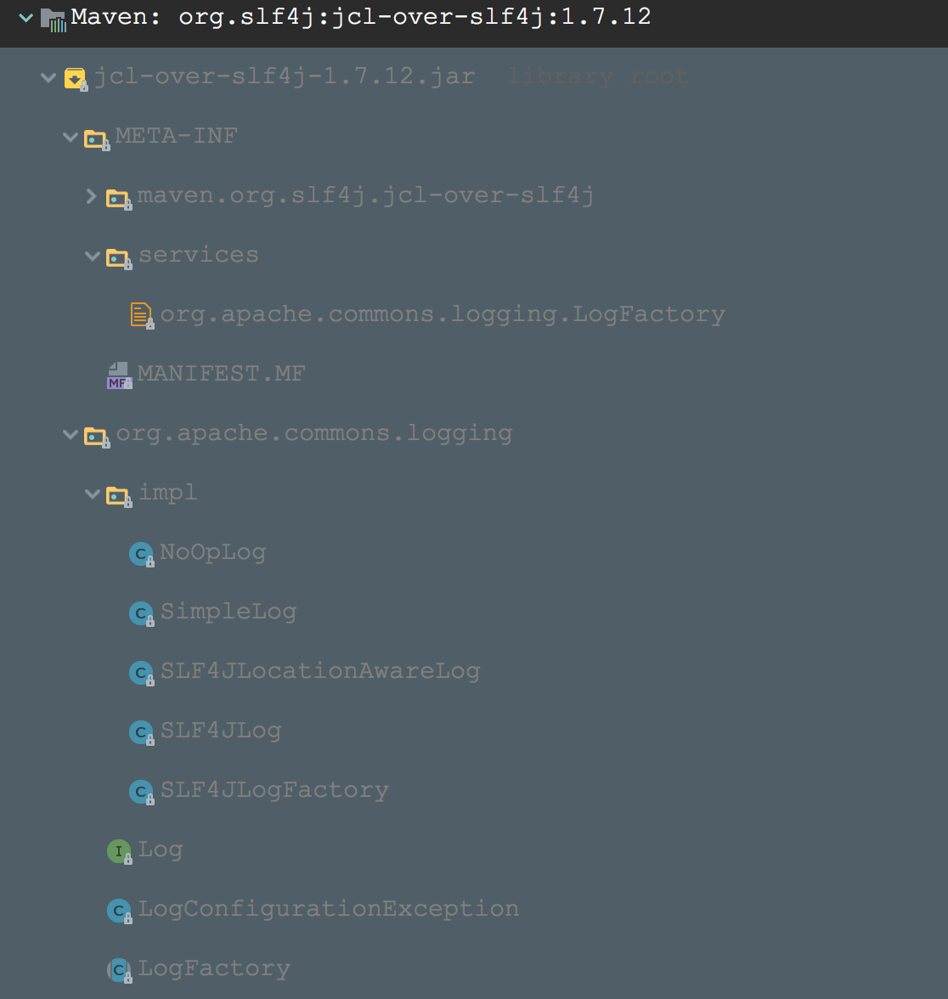
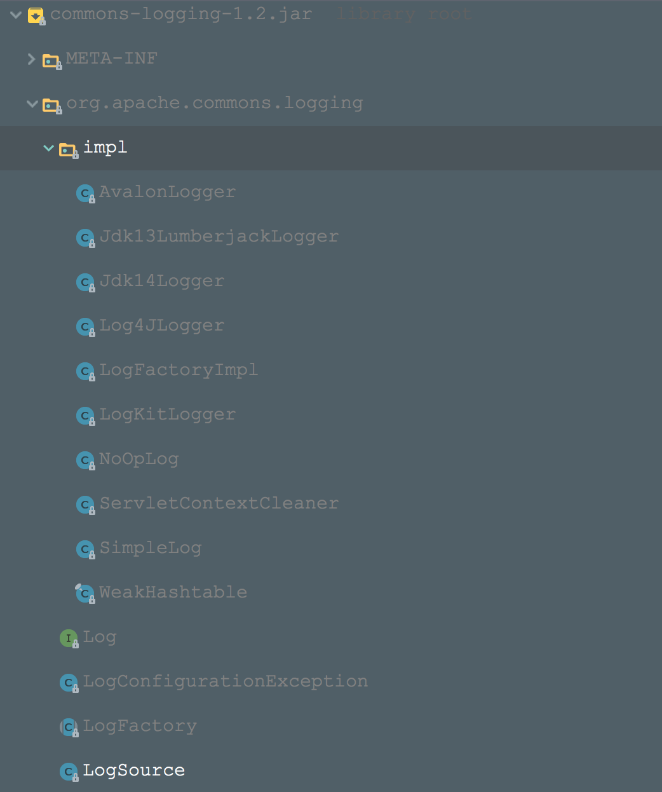

### 使用方法
1. maven依赖
```xml (type)
<dependency>
    <groupId>org.slf4j</groupId>
    <artifactId>jcl-over-slf4j</artifactId>
    <version>1.7.12</version>
</dependency>
<dependency>
    <groupId>org.slf4j</groupId>
    <artifactId>slf4j-api</artifactId>
    <version>1.7.12</version>
</dependency>
<dependency> 
    <groupId>ch.qos.logback</groupId> 
    <artifactId>logback-core</artifactId> 
    <version>1.1.3</version> 
</dependency> 
<dependency> 
    <groupId>ch.qos.logback</groupId> 
    <artifactId>logback-classic</artifactId> 
    <version>1.1.3</version> 
</dependency>
```
jcl-over-slf4j (替代了commons-logging)

2. 首先在类路径下编写logback的配置文件logback.xml
3. 代码调用,@see LogbackTest

### 使用案例分析
   logback本身的使用其实就和slf4j绑定了起来，现在要想指定commons-logging的底层log实现是logback，则需要2步走
    
    第一步： 先将commons-logging底层的log实现转向slf4j (jcl-over-slf4j干的事)
    第二步： 再根据slf4j的选择底层日志原理，我们使之选择上logback
    
   这样就可以完成commons-logging与logback的集成。即写着commons-logging的API，底层却是logback来进行输出
    
  然后来具体分析下整个过程的源码实现：
    
  + 先看下jcl-over-slf4j都有哪些内容(它可以替代了commons-logging)，如下图 jcl转向slf4j
    
    + commons-logging中的Log接口和LogFactory类等
    
      这是我们使用commons-logging编写需要的接口和类
    
    +  去掉了commons-logging原生包中的一些Log实现和默认的LogFactoryImpl
       只有SLF4JLog实现和SLF4JLogFactory
    
    这就是jcl-over-slf4j的大致内容
    
    这里可以与commons-logging原生包中的内容进行下对比。原生包中的内容如下：
    
    
  + 获取获取LogFactory的过程
    
    jcl-over-slf4j包中的LogFactory和commons-logging中原生的LogFactory不一样，jcl-over-slf4j中的LogFactory直接限制死，是SLF4JLogFactory，源码如下：

    ```java
    public abstract class LogFactory {
        
           static LogFactory logFactory = new SLF4JLogFactory();
           //略
        }
    ``` 
    
    
  + 根据LogFactory获取Log的过程
    
     这就需要看下jcl-over-slf4j包中的SLF4JLogFactory的源码内容：    
    ```java (type)
    Log newInstance; Logger slf4jLogger = LoggerFactory.getLogger(name); if (slf4jLogger instanceof LocationAwareLogger) {
        
           newInstance = new SLF4JLocationAwareLog((LocationAwareLogger) slf4jLogger);
        } else {
        
           newInstance = new SLF4JLog(slf4jLogger);
        }
    ``` 
   
    可以看到其实是用slf4j的LoggerFactory先创建一个slf4j的Logger实例(这其实就是单独使用logback的使用方式，见logback原生案例)。
    
    然后再将这个Logger实例封装成common-logging定义的Log接口实现，即SLF4JLog或者SLF4JLocationAwareLog实例。
    
    所以我们使用的commons-logging的Log接口实例都是委托给slf4j创建的Logger实例（slf4j的这个实例又是选择logback后产生的，即slf4j产生的Logger实例最终还是委托给logback中的Logger的）