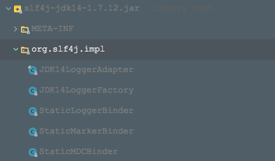

### 使用方法
1. maven依赖
```xml (type)
<dependency>
    <groupId>org.slf4j</groupId>
    <artifactId>slf4j-api</artifactId>
    <version>1.7.12</version>
</dependency>
<dependency>
    <groupId>org.slf4j</groupId>
    <artifactId>slf4j-jdk14</artifactId>
    <version>1.7.12</version>
</dependency>
```
2.使用方法 @see JulSlf4jTest

### 使用案例原理分析
先看下slf4j-jdk14.jar包中的内容：

从中可以看到：
的确是有org/slf4j/impl/StaticLoggerBinder.class类
该StaticLoggerBinder返回的ILoggerFactory类型将会是JDK14LoggerFactory
JDK14LoggerAdapter就是实现了slf4j定义的Logger接口.

下面梳理下整个流程：
+ 获取ILoggerFactory的过程
由于类路径下有org/slf4j/impl/StaticLoggerBinder.class，所以会选择slf4j-jdk14中的StaticLoggerBinder来创建单例对象并返回ILoggerFactory，来看下StaticLoggerBinder中的ILoggerFactory是什么类型：
    ```java (type)
    private StaticLoggerBinder() {
    
       loggerFactory = new org.slf4j.impl.JDK14LoggerFactory();
    }
    ```
    所以返回了JDK14LoggerFactory的实例
    
+ 根据ILoggerFactory获取Logger的过程
  来看下JDK14LoggerFactory是如何返回一个slf4j定义的Logger接口的实例的，源码如下：
  ```java (type)
    java.util.logging.Logger julLogger = java.util.logging.Logger.getLogger(name); 
    Logger newInstance = new JDK14LoggerAdapter(julLogger);
  ```
  可以看到，就是使用jdk自带的logging的原生方式来先创建一个jdk自己的java.util.logging.Logger实例，参见jdk-logging的原生写法
  
  然后利用JDK14LoggerAdapter将上述的java.util.logging.Logger包装成slf4j定义的Logger实例
  
  所以我们使用slf4j来进行编程，最终会委托给jdk自带的java.util.logging.Logger去执行。
  


