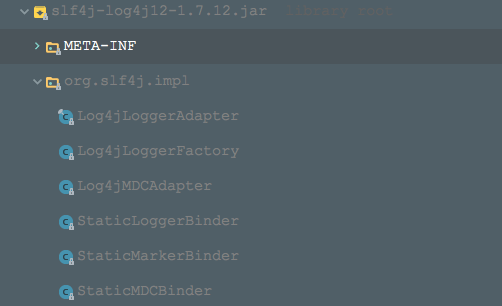

### 使用方法
1. maven依赖
```xml (type)
<!-- slf4j -->
<dependency>
    <groupId>org.slf4j</groupId>
    <artifactId>slf4j-api</artifactId>
    <version>1.7.12</version>
</dependency>

<!-- slf4j-log4j -->
<dependency>
    <groupId>org.slf4j</groupId>
    <artifactId>slf4j-log4j12</artifactId>
    <version>1.7.12</version>
</dependency>

<!-- log4j -->
<dependency>
    <groupId>log4j</groupId>
    <artifactId>log4j</artifactId>
    <version>1.2.17</version>
</dependency>
```
2. 编写log4j.properties配置文件,放到类路径下
3. 代码调用 @see Log4jSlf4JTest

### 使用案例原理分析
先来看下slf4j-log4j12包中的内容：


+ 的确是有org/slf4j/impl/StaticLoggerBinder.class类
+ 该StaticLoggerBinder返回的ILoggerFactory类型将会是Log4jLoggerFactory
+ Log4jLoggerAdapter就是实现了slf4j定义的Logger接口
  
来看下具体过程： 
1. 获取对应的ILoggerFactory
  从上面的slf4j的原理中我们知道：ILoggerFactory是由StaticLoggerBinder来创建出来的，所以可以简单分成2个过程：
   + 第一个过程：slf4j寻找绑定类StaticLoggerBinder
   
     使用ClassLoader来加载 "org/slf4j/impl/StaticLoggerBinder.class"这样的类的url，然后就找到了slf4j-log4j12包中的StaticLoggerBinder
   + 第二个过程：创建出StaticLoggerBinder实例，并创建出ILoggerFactory
    
     源码如下：
     ```java (type)
     StaticLoggerBinder.getSingleton().getLoggerFactory()
     ```
     以slf4j-log4j12中的StaticLoggerBinder为例，创建出的ILoggerFactory为Log4jLoggerFactory
     
2. 根据ILoggerFactory获取Logger的过程
   
   来看下Log4jLoggerFactory是如何返回一个slf4j定义的Logger接口的实例的，源码如下：
   ```java (type)
   org.apache.log4j.Logger log4jLogger; 
   if (name.equalsIgnoreCase(Logger.ROOT_LOGGER_NAME))
   
      log4jLogger = LogManager.getRootLogger();
   else
   
      log4jLogger = LogManager.getLogger(name);
   Logger newInstance = new Log4jLoggerAdapter(log4jLogger);
   ```
   + 我们可以看到是通过log4j1的原生方式，即使用log4j1的LogManager来获取，引发log4j1的加载配置文件，然后初始化，最后返回一个org.apache.log4j.Logger log4jLogger，参见log4j1原生的写法
   + 将上述的org.apache.log4j.Logger log4jLogger封装成Log4jLoggerAdapter，而Log4jLoggerAdapter是实现了slf4j的接口，所以我们使用的slf4j的Logger接口实例（这里即Log4jLoggerAdapter）都会委托给内部的org.apache.log4j.Logger实例
    

  
    