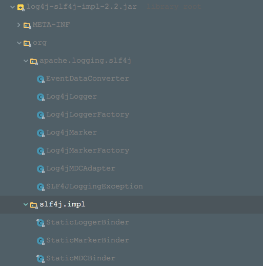

### 使用方法
1. maven依赖
```xml (type)
<!-- slf4j -->
<dependency>
    <groupId>org.slf4j</groupId>
    <artifactId>slf4j-api</artifactId>
    <version>1.7.12</version>
</dependency>
<!-- log4j2 -->
<dependency>
    <groupId>org.apache.logging.log4j</groupId>
    <artifactId>log4j-api</artifactId>
    <version>2.2</version>
</dependency>
  <dependency>
    <groupId>org.apache.logging.log4j</groupId>
    <artifactId>log4j-core</artifactId>
    <version>2.2</version>
  </dependency>
<!-- log4j-slf4j-impl -->
<dependency>
    <groupId>org.apache.logging.log4j</groupId>
    <artifactId>log4j-slf4j-impl</artifactId>
    <version>2.2</version>
</dependency>
```
log4j-slf4j-impl （用于log4j2与slf4j集成）

2. 编写log4j2的配置文件log4j2.xml
3. 调用方法 @see Log4j2Slf4jTest

### 使用案例原理分析
先来看下log4j-slf4j-impl包中的内容：

+ 的确是有org/slf4j/impl/StaticLoggerBinder.class类
+ 该StaticLoggerBinder返回的ILoggerFactory类型将会是Log4jLoggerFactory(这里的Log4jLoggerFactory与上述log4j1集成时的Log4jLoggerFactory是不一样的)
+ Log4jLogger就是实现了slf4j定义的Logger接口

来看下具体过程：

1. 获取对应的ILoggerFactory

+ 第一个过程：slf4j寻找绑定类StaticLoggerBinder

  使用ClassLoader来加载 "org/slf4j/impl/StaticLoggerBinder.class"这样的类的url，然后就找到了log4j-slf4j-impl包中的StaticLoggerBinder

+  第二个过程：创建出StaticLoggerBinder实例，并创建出ILoggerFactory

  log4j-slf4j-impl包中的StaticLoggerBinder返回的ILoggerFactory是Log4jLoggerFactory

2. 根据ILoggerFactory获取Logger的过程

   来看下Log4jLoggerFactory是如何返回一个slf4j定义的Logger接口的实例的，源码如下：
   ```java (type)
   @Override protected Logger newLogger(final String name, final LoggerContext context) {
   
      final String key = Logger.ROOT_LOGGER_NAME.equals(name) ? LogManager.ROOT_LOGGER_NAME : name;
      return new Log4jLogger(context.getLogger(key), name);
   }
   
   @Override protected LoggerContext getContext() {
   
      final Class<?> anchor = ReflectionUtil.getCallerClass(FQCN, PACKAGE);
      return anchor == null ? LogManager.getContext() : getContext(ReflectionUtil.getCallerClass(anchor));
   }
   ```


+  我们可以看到是通过log4j2的原生方式，即使用log4j2的LoggerContext来获取，返回一个org.apache.logging.log4j.core.Logger即log4j2定义的Logger接口实例，参见log4j2原生的写法

+ 将上述的org.apache.logging.log4j.core.Logger封装成Log4jLogger，而Log4jLogger是实现了slf4j的Logger接口的，所以我们使用的slf4j的Logger接口实例（这里即Log4jLogger）都会委托给内部的log4j2定义的Logger实例。

上述获取LoggerContext的过程也是log4j2的原生方式：

    LogManager.getContext()

该操作会去加载log4j2的配置文件，引发log4j2的初始化


