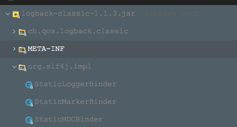

### 使用方法
1. maven依赖
```xml (type)
<!-- slf4j-api -->
<dependency>
    <groupId>org.slf4j</groupId>
    <artifactId>slf4j-api</artifactId>
    <version>1.7.12</version>
</dependency>
<!-- logback -->
<dependency> 
    <groupId>ch.qos.logback</groupId> 
    <artifactId>logback-core</artifactId> 
    <version>1.1.3</version> 
</dependency> 
<dependency> 
    <groupId>ch.qos.logback</groupId> 
    <artifactId>logback-classic</artifactId> 
    <version>1.1.3</version> 
</dependency>
```
logback-classic（已含有对slf4j的集成包）

2. 编写logback的配置文件logback.xml
3. 方法调用 @see LogbackTest


### 使用案例原理分析
先来看下logback-classic包中与slf4j集成的内容：

+ 的确是有org/slf4j/impl/StaticLoggerBinder.class类
+ 该StaticLoggerBinder返回的ILoggerFactory类型将会是LoggerContext(logback的对象)
+ logback自己定义的ch.qos.logback.classic.Logger类就是实现了slf4j定义的Logger接口

1. 获取对应的ILoggerFactory

    + 第一个过程：slf4j寻找绑定类StaticLoggerBinder

      使用ClassLoader来加载 "org/slf4j/impl/StaticLoggerBinder.class"这样的类的url，然后就找到了logback-classic包中的StaticLoggerBinder

    +  第二个过程：创建出StaticLoggerBinder实例，并创建出ILoggerFactory

      logback-classic包中的StaticLoggerBinder返回的ILoggerFactory是LoggerContext(logback的对象)

      创建出单例后，同时会引发logback的初始化，这时候logback就要去寻找一系列的配置文件，尝试加载并解析。

2. 根据ILoggerFactory获取Logger的过程

   来看下LoggerContext(logback的对象)是如何返回一个slf4j定义的Logger接口的实例的：

   该LoggerContext(logback的对象)返回的ch.qos.logback.classic.Logger(logback的原生Logger对象)就是slf4j的Logger实现类。

